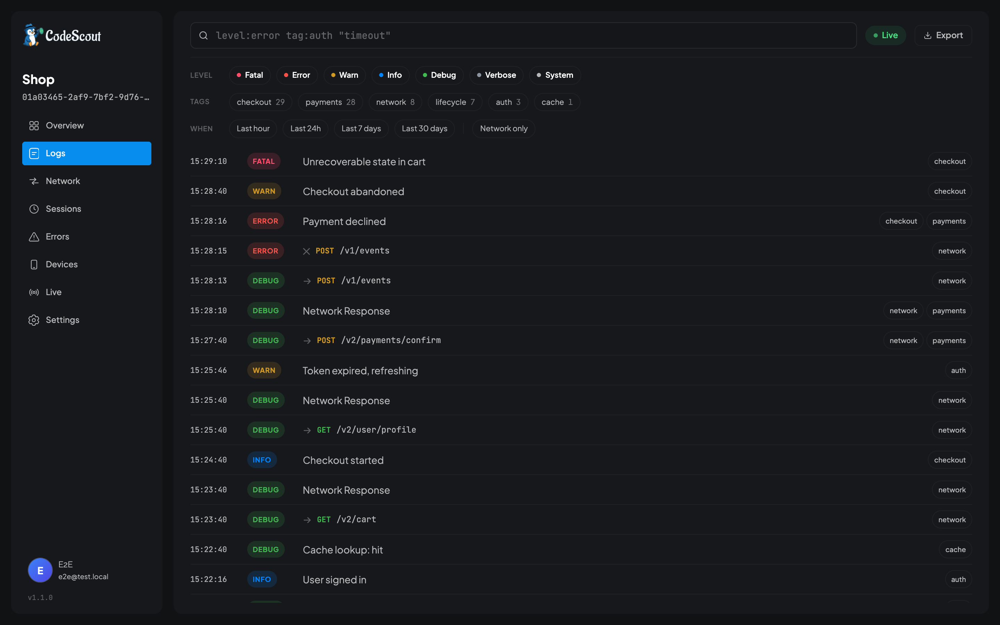
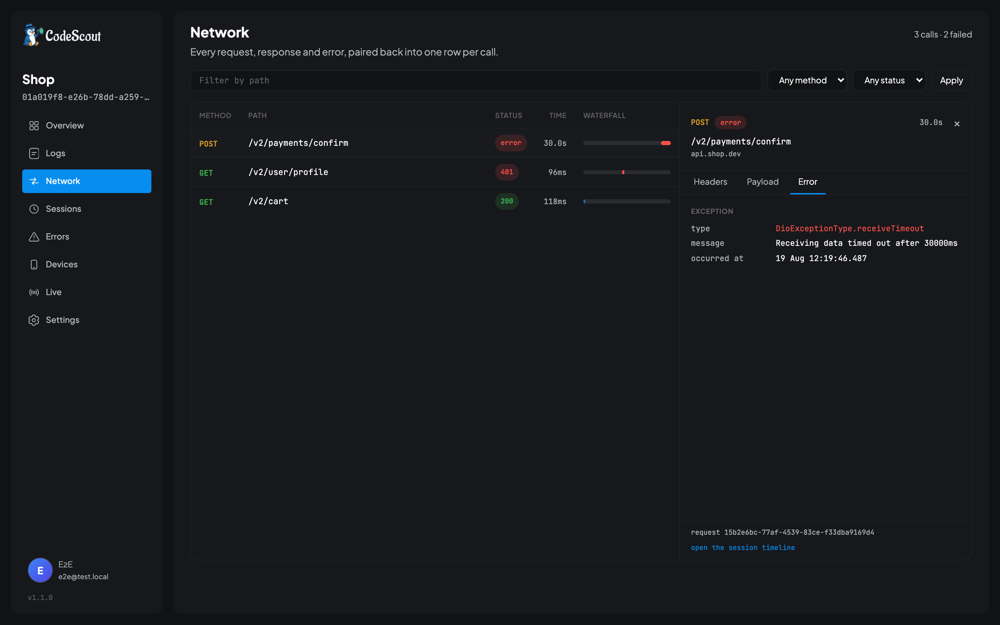
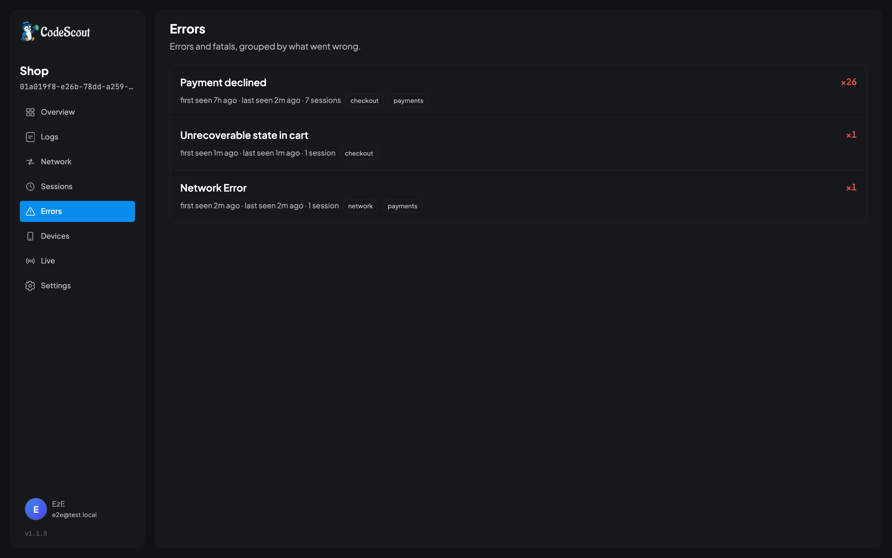
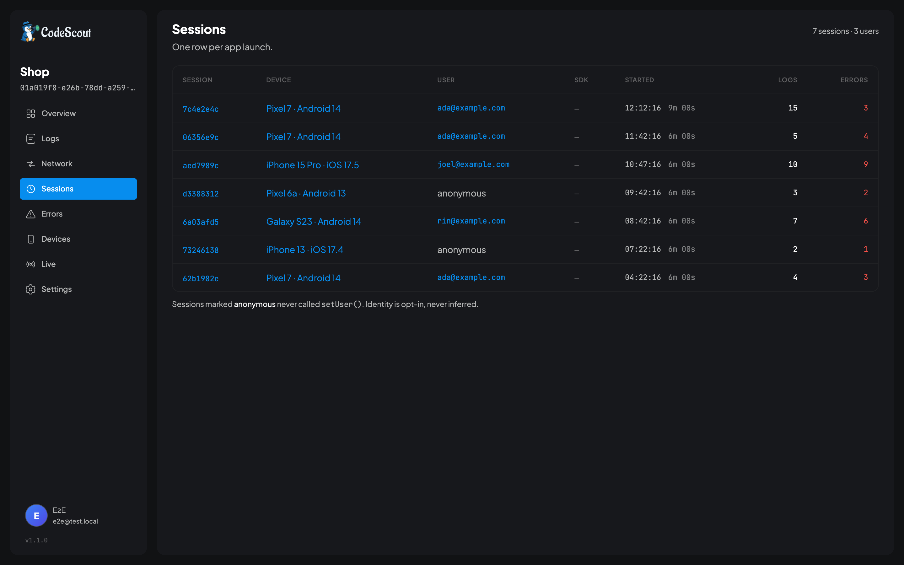
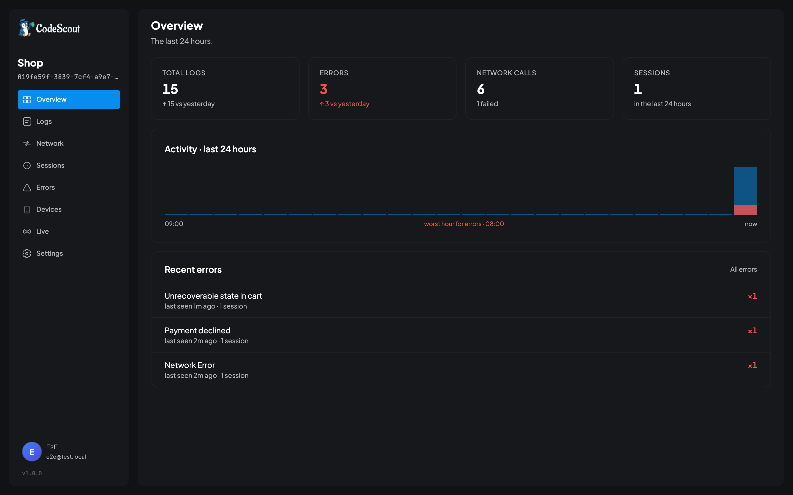

<p align="center">
  
</p>

<p align="center">
  Self-hosted logging and network inspection for Flutter apps.
</p>

<p align="center">
  <a href="https://github.com/getcodescout/code_scout/actions/workflows/ci.yml"></a>
  <a href="https://hub.docker.com/r/touheed10/code_scout"></a>
  <a href="https://pub.dev/packages/code_scout"></a>
  
  <a href="LICENSE"></a>
</p>

<p align="center">
  <a href="https://codescout.tech">Website</a> &middot;
  <a href="https://codescout.tech/docs/">Documentation</a> &middot;
  <a href="https://github.com/getcodescout/code_scout_flutter">Flutter SDK</a> &middot;
  <a href="https://hub.docker.com/r/touheed10/code_scout">Docker Hub</a>
</p>

---

Add one package to your Flutter app. Every log line and every HTTP request gets captured, printed
to your console, saved on the device, and sent to a dashboard you run yourself. From there you can
search it, filter by tag, replay a session, or watch a phone live while someone reproduces a bug in
front of you.

Code Scout is not a crash reporter. Crashlytics tells you the app crashed. Code Scout shows you
what it was doing for the five minutes before. Plenty of teams run both.

**You host it.** Your logs go to your server and your database. There is no account to sign up for
and no usage tier, because there is nobody in the middle.

<p align="center">
  
</p>

## Try it

You need Docker. Nothing else.

```bash
git clone https://github.com/getcodescout/code_scout.git
cd code_scout
docker compose up
```

That starts Code Scout and a Postgres database, and creates the tables on first run. Open
<http://localhost:24275>.

The first page asks you to register. The first account you make becomes the super admin, which is
the role that sees every project and can change instance-wide settings. After that the same page
becomes an ordinary login, and further accounts are made from the Members screen rather than by
registering again.

Create a project, and its ID and secret appear on the last step. You can read the secret again
later under Settings and then SDK setup, or rotate it if it leaks. That tab only appears for
people with manage rights on the project, so a read-only member will not find it.

> Please change the passwords in `docker-compose.yml` before putting this anywhere other people can
> reach.

### Pointing it at a database you already have

If you already run Postgres somewhere, whether that is RDS, Cloud SQL or your own box, delete the
`db` service from `docker-compose.yml` and give the app your connection details instead.

```bash
docker run -p 24275:24275 \
  -e CS_DB_HOST=your-db.example.com \
  -e CS_DB_USER=code_scout \
  -e CS_DB_PASSWORD=secret \
  -e CS_DB_NAME=code_scout \
  -e CS_DB_SSLMODE=require \
  touheed10/code_scout:edge
```

## Connecting your app

```bash
flutter pub add code_scout
flutter pub add code_scout_dio    # if you use Dio
flutter pub add code_scout_http   # if you use package:http
```

Start it once, early in `main`:

```dart
await CodeScout.instance.init(
  freshContextFetcher: () => context,
  configuration: CodeScoutConfiguration(
    logging: LoggingBehavior(minimumLevel: LogLevel.all),
    projectCredentials: ProjectCredentials(
      link: 'http://localhost:24275/',
      projectID: 'your-project-id',
      projectSecret: 'your-secret-key',
    ),
    sync: LogSyncBehavior(syncInterval: Duration(seconds: 30)),
  ),
);
```

Then log things:

```dart
final scout = CodeScout.instance;

scout.d('Cart restored from cache');
scout.i('Checkout started', tags: {'analytics', 'checkout'});
scout.e('Payment failed', error: e, stackTrace: st);
```

And capture your network calls by wrapping the client you already have:

```dart
dio.interceptors.add(CodeScoutDioInterceptor());              // Dio

final client = CodeScoutHttpClient(client: myExistingClient); // package:http
```

Pass your existing client in. If you leave `client:` out, the wrapper builds a plain new one and
any base headers, proxy or timeout you had configured are quietly lost.

`projectCredentials` is optional. Leave it out and Code Scout is a local logging library: you get
console output and an on-device viewer, and nothing leaves the phone. Add the credentials when you
want the dashboard as well.

Full setup guide: [codescout.tech/docs](https://codescout.tech/docs/).

## What you get

### Logs

Every control in the log viewer is a link, so the address bar always describes what you are looking
at. Paste that URL to a colleague and they see the same screen.

<p align="center">
  
</p>

The search box takes a small query language, and you can mix it with plain text.

| | |
|---|---|
| `level:error` | only that level. Repeat it for more: `level:error level:fatal` |
| `tag:checkout` | logs carrying a tag |
| `-tag:heartbeat` | everything except that tag |
| `session:4f2a81b0-9d3c-4e77-b0a1-2f9c6d5e8a41` | one app launch |
| `request:7d19c204-1b6e-4a52-9c88-3ee1f0a7b942` | one network call and both of its logs |
| `user:ada@example.com` | everything that happened to one person |
| `installation:9eec2f07-52c1-4a90-8e6b-77d0c3b41f28` | one install, across launches |
| `app_version:3.11.2` | one build of your app |
| `device:Pixel` | a device model, matched loosely |
| `os:Android` | an OS name or version |
| `"gateway timeout"` | plain text in the message |

`level:` is a set rather than a threshold, so `level:error` on its own does not include fatals.
That is worth remembering during an incident, which is exactly when you would type it.

The three id filters take the whole UUID. A shortened one is refused outright rather than
matched as a prefix, so paste the id rather than the first few characters of it. `user:`,
`installation:` and `app_version:` all match exactly, while `device:` and `os:` are the two that
match loosely.

### Network

The SDK records a request, a response and an error separately. The dashboard pairs them back into
one row per call, with a waterfall showing when each one ran and how long it took.

<p align="center">
  
</p>

Headers, payload and response body each get their own tab, the same way browser dev tools do.
Anything the SDK redacted shows as a redaction rather than as the value.

### Errors

The same bug usually arrives thousands of times with slightly different wording. Errors are grouped
by shape, so `User 4821 not found` and `User 9134 not found` are one row and one problem.

<p align="center">
  
</p>

### Sessions and devices

Every app launch is recorded with the phone it ran on, the OS, and which build of your app it was.
That turns "it only happens for one customer" into something you can actually look at.

<p align="center">
  
</p>

### Live devices

Create a six character code in the dashboard, type it into the app, and watch that phone's logs
arrive as they happen. Nothing streamed this way is stored, so it is safe to point at a build you
would not want filling up your database.

### Your coding agent can read all of it

Code Scout speaks [MCP](https://modelcontextprotocol.io), so the agent you already have open can
search your logs, read grouped errors, walk a session from start to finish, inspect network calls,
and read a paired device's local databases. Create a token under Personal settings and point a
client at it:

```bash
claude mcp add --transport http code-scout https://logs.example.com/api/mcp \
  --header "Authorization: Bearer csp_your_token"
```

Then ask it something. The handover this is really for: a tester hits a bug, copies the report out
of the app's overlay, and sends it over. That report carries the session id, so the developer
pastes it into their agent and the agent reads the whole launch back instead of working from a
description of it.

Every tool is read only, and that is a property of what they can express rather than a rule
enforced somewhere: none of them takes an operation, a statement, or a value to write. A token sees
exactly the projects its owner sees. See
[Reading Code Scout with an AI agent](https://codescout.tech/docs/guides/mcp/).

### Overview

<p align="center">
  
</p>

### Accounts and access

Three roles for the instance plus a level per project. You see the projects you belong to and
nothing else. A project you cannot see answers 404 rather than 403, so the list of projects you
are not in stays private.

### Keeping the volume down

Session sampling per project, a daily cap per project, a cap on upload size, and retention. All of
it is read from the database as it is used, so changing a setting takes effect without a restart.

## About your credentials

Nothing is hidden unless you say so, because the auth header is quite often the reason a request is
failing, and a debugging tool that hides it is not much of a debugging tool.

`RedactionBehavior.recommended()` turns on the usual suspects in one line. Whatever you name is
stripped on the device, before anything is written to disk or uploaded. Decide this deliberately
before you point it at production, and read
[Redaction and privacy](https://codescout.tech/docs/guides/redaction/) first.

## How it fits together

```
Flutter app                              Your server
┌────────────────────────┐              ┌──────────────────────────┐
│ CodeScout.instance.i() │              │                          │
│ Dio / http interceptor │              │  POST /api/logs/dump     │
│          ↓             │  ──batched── │          ↓               │
│ SQLite (on device)     │   tar.gz     │  Postgres                │
│          ↓             │   upload     │          ↓               │
│ Sync worker            │              │  Dashboard + live tail   │
└────────────────────────┘              └──────────────────────────┘
```

Logs are written to SQLite on the device first, so nothing is lost when the network drops. A
background worker batches them up, compresses them off the main thread, and uploads. If an upload
fails the batch is put back and tried again later.

| | |
|---|---|
| **Dashboard** (this repo) | Go 1.24, Postgres 16, Templ, HTMX, Tailwind |
| **Flutter SDK** | [`code_scout`](https://pub.dev/packages/code_scout), [`code_scout_dio`](https://pub.dev/packages/code_scout_dio), [`code_scout_http`](https://pub.dev/packages/code_scout_http) |
| **SDK source** | [getcodescout/code_scout_flutter](https://github.com/getcodescout/code_scout_flutter) |

## Configuration

Everything is set with environment variables. You can put the same keys in `/etc/code-scout.conf`
as TOML if you prefer a file. The key is the variable name with `CS_` removed and the rest
lower-cased, so `CS_DB_HOST` becomes `db_host` and `CS_CONN_MAX_LIFETIME_MINUTES` becomes
`conn_max_lifetime_minutes`. Numbers go in unquoted: a quoted one is ignored and you silently
get the default instead. Environment variables win.

| Variable | Default | |
|---|---|---|
| `CS_DB_HOST` | | required |
| `CS_DB_PORT` | `5432` | |
| `CS_DB_USER` | | required |
| `CS_DB_PASSWORD` | | |
| `CS_DB_NAME` | | required |
| `CS_DB_SSLMODE` | `disable` | `require`, `verify-ca` or `verify-full`. Managed databases usually want at least `require` |
| `CS_HOST` | `0.0.0.0` | |
| `CS_PORT` | `24275` | |
| `CS_PUBLIC_BASE_URL` | | the address people actually reach this instance on, if it sits behind a proxy |
| `CS_MAX_OPEN_CONNS` | `25` | keep this under your database's connection limit |
| `CS_MAX_IDLE_CONNS` | `5` | |
| `CS_CONN_MAX_LIFETIME_MINUTES` | `30` | |

The server waits for the database on startup and retries, so it is fine to start both at once.
`GET /healthz` answers 200 when it is ready and 503 when the database is not, which is what the
container health check uses.

If you are locked out of the only owner account, `code_scout reset-password --email=you@example.com`
prints a temporary password once and signs that account out everywhere. Inside Docker that is
`docker exec <container> code_scout reset-password --email=you@example.com`. The binary is on
the PATH inside the image, so there is no `./` in front of it. Run it in the container that
already has the `CS_DB_*` settings, because the command reads the same configuration the server
does. The temporary password is printed once and stored nowhere, so copy it before you close the
terminal.

### Behind a reverse proxy

Two things here are not ordinary HTTP: live sessions upgrade to a WebSocket, and the dashboard
watches them over Server-Sent Events. A default nginx config forwards neither, **with nothing in
any log to say so**. Everything else keeps working, so it rarely looks like a proxy problem.

```nginx
map $http_upgrade $connection_upgrade { default upgrade; '' close; }

location / {
    proxy_pass http://127.0.0.1:24275;
    proxy_http_version 1.1;
    proxy_set_header Host $host;
    proxy_set_header X-Forwarded-For $proxy_add_x_forwarded_for;
    proxy_set_header X-Forwarded-Proto $scheme;

    proxy_set_header Upgrade $http_upgrade;
    proxy_set_header Connection $connection_upgrade;
    proxy_buffering off;
    proxy_read_timeout 3600s;
}
```

Caddy needs none of this: `reverse_proxy 127.0.0.1:24275` handles both. Full notes, including why
the `map` beats hardcoding the header, are in
[the setup guide](https://codescout.tech/docs/guides/server-setup/#behind-a-reverse-proxy).

## Development

```bash
make dev-setup     # first time: writes .env and creates the local database
make dev           # hot reloading dev server
make db-reset      # wipe the local database and start over
make test          # unit tests
make test-all      # unit and integration tests, against a scratch database
make test-e2e      # browser tests against a real server
make test-sdk-e2e  # the real Flutter SDK against a real server
make screenshots   # regenerate the images in this README
make build         # linux/amd64 binary into ./bin
```

`make dev` needs Go 1.24 or newer, a local Postgres, `air` and `templ`.

`make db-reset` drops the local database and recreates it empty; the next `make dev` rebuilds every
table, because the server migrates its schema on startup. That is the normal way to pick up a model
change here, because there is no deployed instance to migrate, so a schema change is a rebuild. It asks you
to type the database name first, and `force=1` skips the prompt for scripts. Stop `make dev` before
running it: Postgres refuses to drop a database anything is still connected to, and the reset
terminates those connections to get past that.

Some tests need a real Postgres, because they cover unique indexes and `ON CONFLICT` behaviour that
a mock cannot exercise. They skip unless `CS_TEST_DB` is set, and `make test-all` sets it for you.

`make test-sdk-e2e` is the interesting one. It runs the real SDK against a real dashboard, so it is
the only test that proves the two repositories still agree with each other. It expects
`code_scout_flutter` checked out beside this repo, or pass `sdk_dir=`.

The UI is [Templ](https://templ.guide). Edit the `.templ` files and never the generated `_templ.go`
files, which get overwritten on the next build. `make dev` regenerates them as you type.

The layout is hexagonal:

| Package | Holds |
|---|---|
| `internal/domain` | entities and error codes, no framework code |
| `internal/ports` | the interfaces everything else depends on |
| `internal/services` | business logic |
| `internal/adapters/db` | GORM models, mappers and repositories |
| `server/handlers` | HTTP handlers |
| `view` | Templ templates |

Handlers depend on the interfaces rather than concrete types, and everything is wired by hand in
`main.go`. There is no global database handle.

Read `DESIGN.md` before changing anything visual.

## Contributing

Issues and pull requests are welcome, and small ones are the easiest to accept. Please open an
issue before starting something large so we can check it fits where the project is going.

See [CONTRIBUTING.md](CONTRIBUTING.md) for how to get set up and what a good pull request looks
like. Everything ships with tests, including the browser tests, and the honest way to check one is
to undo the fix and watch the test fail.

Right now the most useful contributions are anything that makes the first fifteen minutes easier
for somebody who has never seen this before, and browser test coverage for the screens the
current suite does not reach.

## Status

Version 1.0 is complete. The Flutter SDK is published on pub.dev and everything described here
works today.

The Docker image is published as `touheed10/code_scout:edge` from `main`. Tagged releases will add
version tags and `latest`.

Deliberately left until after 1.0: alert rules, crash reporting, performance metrics, and full
text search.

## License

MIT. See [LICENSE](LICENSE).
